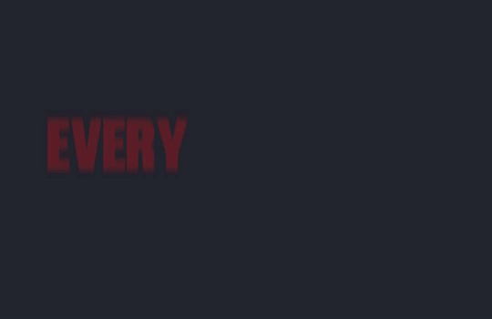

<div align="center">

# Captions

### Every word, right on time.

Turn your transcript into animated captions with precise word highlights, your brand colors, and a transparent overlay ready for your editing timeline.

[](../../README.md#video)
[](#requirements)
[](#what-you-get)
[](#export-defaults)
[](../../LICENSE)

[Install](#install) · [Preview](#the-style) · [How it works](#how-it-works) · [Requirements](#requirements) · [Development](#development)

<br>


**Montserrat Difference**<br>
<sub>Preview generated from the actual caption component. The final overlay has a transparent background.</sub>

</div>

---

## Made for your editing timeline

Give the agent your words and their timing—or your words plus the matching audio. It prepares a new Remotion project and exports the captions as a separate layer you can place above your footage.

| | What you get |
| :--- | :--- |
| **Timing that follows speech** | Word highlights follow supplied timestamps or local audio alignment, including pauses and repeated words. |
| **A look you can make yours** | A style gallery, live color sample, and explicit choices for base text, active words, and shadow. |
| **An editable result** | A silent ProRes 4444 overlay with alpha, plus the project, saved settings, and placement instructions. |

## Install

Give this directory URL to an agent that supports installable skills:

```text
Install this skill: https://github.com/omnedia/skills/tree/master/video/captions
```

Install the **complete skill directory**, including its styles, fonts, assets, and helpers.

> [!IMPORTANT]
> The **Remotion plugin must be installed and available in Codex**. It creates each new project in your selected folder. Dependencies are installed in that project, not in the skill directory.

Then attach your transcript and, if needed, its matching audio:

```text
Use the captions skill with these files. Name the project “Launch captions”,
use Active Word Highlight, and keep the default colors and 4K export.
```

On first use, the agent saves your preferred project folder and optionally a named brand palette. It reuses those settings on later runs.

## The style

Browse all available styles below. Click a preview or style name to open its folder, where `STYLE.md` explains fonts, colors, animation, and project overrides.

| [Active Word Highlight](styles/active-word-highlight/) | [Brunson Red Script](styles/brunson-red-script/) | [Editorial Kinetic](styles/editorial-kinetic/) | [Montserrat Difference](styles/montserrat-difference/) |
| :---: | :---: | :---: | :---: |
| [](styles/active-word-highlight/) | [](styles/brunson-red-script/) | [](styles/editorial-kinetic/) | [](styles/montserrat-difference/) |
| Stable Inter Bold phrases with short fades and a warm yellow highlight on the spoken word. | Authored red headline/script hooks paired with instant small white interview captions. | Mixed-font editorial headlines with teal or gold emphasis, directional entrances, and drawn underlines. | Montserrat compositions with per-group colors, positions, and reveal timing, plus optional Difference blending. |

Previews come from the actual caption components; the final overlays have transparent backgrounds. Choose colors in the local gallery or specify them in your request. Already supplied choices are reused. The [style catalog](styles/catalog.json) lists the bundled styles and their defaults.

Brunson Red Script combines explicitly authored red headline/script hooks with instant small white interview captions. Its font files have separate restrictions; the repository's MIT license does not grant rights to them. Read the [font source notice](styles/brunson-red-script/fonts/SOURCE-NOTICE.txt).

Montserrat Difference exports normal source-color text in one transparent MOV by default. Backdrop-dependent Difference blending requires explicitly requested `footage` or `layers` delivery. See its [style configuration and delivery options](styles/montserrat-difference/STYLE.md).

## What to provide

| Your input | What happens |
| :--- | :--- |
| Transcript with word timestamps | The agent preserves the timing and prepares the captions. |
| Transcript with sentence or cue timestamps | The agent accepts the cues and checks whether word timing is available; matching audio may be needed. |
| Plain transcript + matching audio | Local forced alignment locates the supplied words in the audio. |
| Plain transcript without audio | The agent asks for timed text or matching audio before creating a project. |

No particular transcript file format is required. The agent interprets understandable timing notation and resolves ambiguous units or offsets before rendering.

> [!NOTE]
> Speech timing is never invented from word counts or reading speed. Audio alignment preserves your supplied wording; material text/audio disagreements are surfaced for correction.

## How it works

1. **Read your inputs.** Check timing, the Remotion plugin, and the local runtime.
2. **Resolve the look.** Reuse your choices or open the style and color picker.
3. **Create the project.** Follow the Remotion plugin's setup workflow in your selected folder, then add the caption assets and saved settings.
4. **Create and render.** Build the Remotion animation and render the final transparent overlay. No preview renders, frame screenshots, placement reviews, transparency checks, or audio-silence verification are required.

Completed choices survive interruptions. Existing folders are not overwritten, and later changes to your personal defaults do not alter saved projects.

## Export defaults

| Setting | Default |
| :--- | :--- |
| Composition | 1080 × 1920 · portrait |
| Render scale | **2×** |
| Export resolution | **2160 × 3840** · portrait 4K |
| Frame rate | 30 fps |
| Video format | ProRes 4444 · `.mov` |
| Transparency | Alpha channel, using PNG render frames |
| Audio | Silent; synchronization audio is not included |

A 1920 × 1080 landscape composition exports at **3840 × 2160** with the same 2× scale. Set a per-project scale of 1 for native-resolution output.

JPEG quality is saved as **90**, but remains inactive for PNG frames. The transparent export uses PNG because JPEG cannot preserve alpha; this value is not a ProRes compression setting.

Personal defaults live in `~/.config/codex-captions/config.json`. Font and caption position belong to the selected style, with per-project overrides available. See the [configuration guide](references/configuration.md) for precedence and saved settings.

## What you get

```text
your-project/
├── out/
│   ├── captions.mov             # Final transparent overlay
│   └── preview.mov              # Short review excerpt
├── src/captions/                # Editable caption component
├── public/fonts/               # Bundled font and license
├── project.json                # Resolved settings and word timing
├── EDITOR.md                   # Import and timeline placement
├── captions-render.mjs         # Reproduce the export
└── …                           # Remotion plugin scaffold and dependencies
```

For every style, place the default `captions.mov` above your footage with alpha enabled. Montserrat exports normal source colors by default; rendering with footage or separate Difference layers is optional and must be explicitly requested. Follow `EDITOR.md` for the source offset and timeline placement; leading silence is preserved.

To revisit a generated project:

```bash
npm run captions:studio
npm run captions:preview
npm run captions:render
```

## Example prompts

**Use your brand colors**

```text
Create captions from this word-timed transcript. Use white base text,
#36AADD for the active word, and a black shadow. Name it “Product intro”.
```

**Align supplied wording to audio**

```text
Use the captions skill to align this transcript to the attached audio.
Keep my wording and punctuation, and show me the color picker.
```

**Export for a landscape edit**

```text
Create a 1920×1080 caption composition at 25 fps with 2× export scale.
Use Active Word Highlight with its default colors.
```

## Requirements

| Requirement | When needed |
| :--- | :--- |
| **Remotion plugin in Codex** | Every run; standalone Remotion packages do not replace the plugin. |
| Node.js 22+, npm, and Git | Project setup through the Remotion plugin. |
| FFmpeg and ffprobe | Audio processing and alignment. |
| Remotion's rendering browser and host libraries | Preview and final rendering; downloaded or installed during setup as needed. |
| Python 3.10–3.12 with the alignment dependencies | Only when aligning text to audio. |

Alignment runs locally with stable-ts and Whisper. The first use downloads model weights; the supplied audio and text are not uploaded by the alignment helper. See [input and timing](references/input-and-timing.md) for setup and model details. Remotion's own licensing terms apply to its use.

## Inside the skill

| Path | Purpose |
| :--- | :--- |
| [`SKILL.md`](SKILL.md) | Agent workflow, input handling, and completion requirements. |
| [`styles/`](styles/) | Style catalog, design instructions, animated preview, and licensed font. |
| [`assets/`](assets/) | Reusable caption code and gallery UI. |
| [`config/defaults.json`](config/defaults.json) | Shared starting values, including 2× export scale. |
| [`references/`](references/) | Timing, configuration, project setup, and export details. |
| [`scripts/`](scripts/) | Configuration, gallery, alignment, and developer helpers. |
| [`tests/`](tests/) | Behavioral tests and audio fixtures. |

<details>
<summary><strong>What do the helpers do?</strong></summary>

| Helper | Role |
| :--- | :--- |
| `captions.mjs` + `core.mjs` | Save defaults, prepare a run, and attach caption assets to the plugin-created project. |
| `gallery.mjs` | Serve the local style/color picker and persist selections. |
| `align.py` | Align supplied wording to matching audio. |
| `alignment-requirements.txt` | Declare the local alignment dependencies. |
| `brunson-gallery.mjs` | Regenerate the Brunson gallery animation as a separate maintenance task. |

</details>

## Development

From this skill directory, run the focused behavioral checks:

```bash
node --test tests/core.test.mjs
python -m unittest discover -s tests -p "test_*.py"
```

Developer-only checks are documented in [the acceptance guide](tests/acceptance.md). These are never part of normal caption creation or delivery. Integration checks create temporary Remotion projects outside the skill directory and install dependencies there.

## License

Skill code and documentation use the repository's [MIT License](../../LICENSE). Inter uses [SIL OFL 1.1](styles/active-word-highlight/fonts/LICENSE.txt). Editorial Kinetic includes [Poppins's OFL](styles/editorial-kinetic/fonts/Poppins-LICENSE.txt), [Libre Baskerville's OFL](styles/editorial-kinetic/fonts/LibreBaskerville-LICENSE.txt), and [Lazy Dog's public-domain dedication](styles/editorial-kinetic/fonts/LazyDog-LICENSE.txt), with [sources and checksums](styles/editorial-kinetic/fonts/source.json).

Montserrat uses [SIL OFL 1.1](styles/montserrat-difference/fonts/OFL.txt); [font sources and checksums](styles/montserrat-difference/fonts/source.json) are bundled.

---

<div align="center">

**Your words. Your colors. Ready for the timeline.**

[Back to the skill library](../../README.md#skill-library) · [View on GitHub](https://github.com/omnedia/skills/tree/master/video/captions)

</div>
